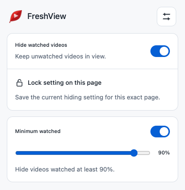
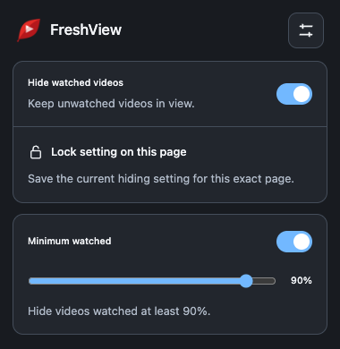
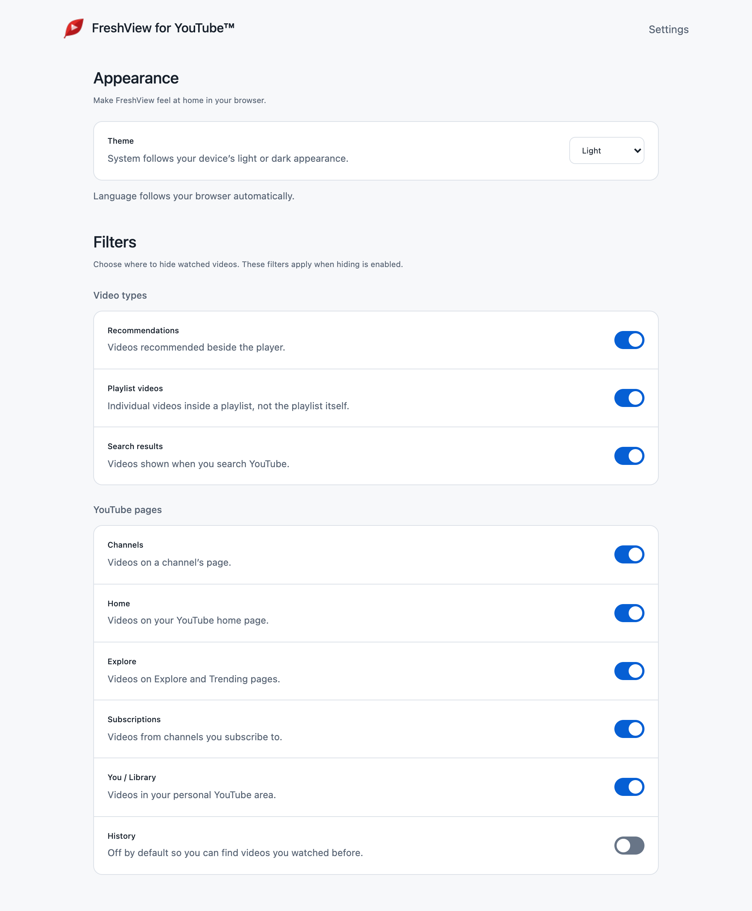
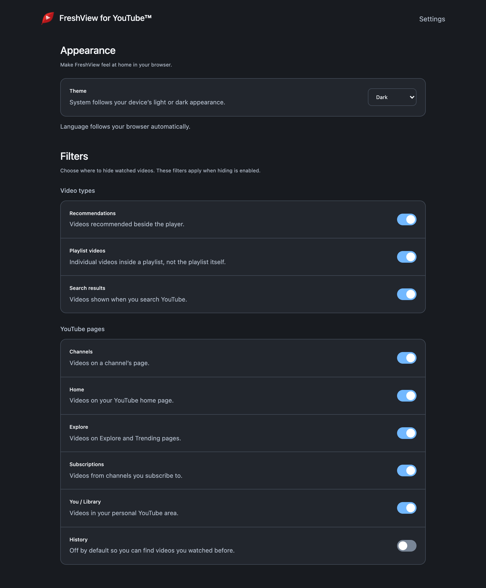

<p align="center">
  
</p>

<h1 align="center">FreshView for YouTube™</h1>

<p align="center">
  Hide watched videos. Find something new.<br>
  <strong>Local filtering · Six languages · System, light &amp; dark themes</strong>
</p>

<p align="center">
  <a href="#install">Install</a> ·
  <a href="#quick-start">Quick start</a> ·
  <a href="#languages-and-appearance">Languages</a> ·
  <a href="#privacy-and-permissions">Privacy</a> ·
  <a href="#development">Development</a>
</p>

FreshView hides YouTube video cards using the watch-progress bars already displayed on the page. Your preferences stay on your device: no account-history retrieval, backend, or browsing-data collection.

Maintained by [roniel-rhack](https://github.com/roniel-rhack), based on [Mandrenkov's original FreshView](https://github.com/Mandrenkov/FreshView).

> **Development version: 3.2.0.** The screenshots and instructions below show this version. It has not been submitted to the browser stores; see [store availability](#install) before installing.

## A look at FreshView

Enable hiding, choose how much of a video counts as watched, and lock that preference to a specific page.

<table>
  <tr>
    <th>Light theme</th>
    <th>Dark theme</th>
  </tr>
  <tr>
    <td></td>
    <td></td>
  </tr>
</table>

Settings brings appearance, video types, and page filters together. Labels are clickable, controls support the keyboard, and the layout adapts to narrow windows and enlarged text.

<p align="center">
  
</p>

<details>
<summary>View Settings in dark theme</summary>

<p align="center">
  
</p>

</details>

*Screenshots captured from the 3.2.0 development extension. The popup was connected to a controlled YouTube test page; no personal browsing data is shown.*

## Install

**Last confirmed store status: September 27, 2026.** Store submissions and public availability are separate steps.

| Browser | Available to install | Under review |
| --- | --- | --- |
| **Chrome** | [Chrome Web Store — 3.0.0](https://chromewebstore.google.com/detail/freshview-for-youtube/glologkcncopfogmaghfgcoloklmella) | **3.1.0**, submitted with automatic publication after approval |
| **Firefox** | This fork's first public release is awaiting approval | **3.1.0** — [Mozilla Add-ons listing](https://addons.mozilla.org/en-US/firefox/addon/freshview-youtube-roniel/) becomes available after approval |

Both 3.1.0 submissions were completed on September 27, 2026. Similarly named Firefox extensions may belong to other maintainers. GitHub's packaging workflow does not publish to either store.

### Try the development version

No build step or dependency installation is needed for the extension itself.

| Browser | Requirements | Load locally |
| --- | --- | --- |
| Chrome / compatible Chromium | **Chrome 121+** | Open `chrome://extensions` (or `edge://extensions`), enable **Developer mode**, choose **Load unpacked**, and select this repository's root folder. |
| Firefox | **Firefox 142+** | Open `about:debugging#/runtime/this-firefox`, choose **Load Temporary Add-on**, and select `manifest.json`. Allow access to YouTube if requested. |

Firefox's temporary installation lasts until the browser restarts. After changing or updating a local installation, reload the extension and refresh open YouTube tabs.

## Quick start

1. Open [desktop YouTube](https://www.youtube.com/).
2. Open FreshView and enable **Hide watched videos**. It is off by default.
3. Adjust **Minimum watched**. The default is **90%**; turning this control off hides only videos marked **100% watched**.
4. Open **Settings** to choose page filters, video types, and appearance. **History** is excluded by default.

### Lock a page's preference

Choose **Lock setting on this page** to save the current hiding state for that exact URL, including its query string. This saved choice overrides the global toggle until you choose **Unlock this page**. Page exclusions in Settings still take precedence.

The popup also explains when a page is excluded, unsupported, or needs refreshing to connect to FreshView.

### Where filtering works

| Supported pages | Supported video types |
| --- | --- |
| Home, channels, Explore/Trending, You/Library, History, subscriptions, search, and playlists | Regular video cards, recommendations, search results, and individual playlist videos |

Modern and legacy YouTube video cards are supported. **Playlist/course summaries, advertisements, and Shorts are excluded.**

### Keyboard shortcuts

Configure shortcuts in your browser's extension-shortcut settings: `chrome://extensions/shortcuts` in Chromium, or **Manage Extension Shortcuts** in Firefox's add-ons manager.

- **Toggle hiding watched videos** changes the global hiding preference.
- **Toggle watch threshold** switches between the saved percentage and 100%.

Locked pages keep their saved hiding state, and excluded pages remain excluded.

## Languages and appearance

| Language | Native name |
| --- | --- |
| English | English |
| Spanish | Español |
| Brazilian Portuguese | Português (Brasil) |
| Japanese | 日本語 |
| Simplified Chinese | 简体中文 |
| Traditional Chinese | 繁體中文 |

The extension automatically follows the browser's **interface language**, with English as the fallback. Selection is local and independent of your location or YouTube's language setting. Some browser language changes require a browser restart.

Choose **System**, **Light**, or **Dark** in Settings. System follows the device's appearance and is the default for new installations; explicit light/dark preferences from older versions are preserved. Controls have visible keyboard focus and respect reduced-motion preferences.

## What's new in 3.2.0

- **Six-language interface:** popup, settings, status messages, accessibility labels, extension description, and shortcut descriptions.
- **Clearer controls:** clickable labels, explanations of the watched percentage, and distinct lock/unlock icons and text.
- **Flexible appearance:** responsive settings and System/Light/Dark themes with existing preferences preserved.
- **Better keyboard behavior:** page locks retain focus, and disabling the threshold does not erase its saved percentage.
- **Lighter UI work:** no slider layout measurements or icon-font usage; locale files are validated during packaging.

<details>
<summary>Previous release: 3.1.0</summary>

- Fixed restoration after card reordering, reuse, navigation, and filter changes.
- Added modern recommendations and detection of late progress/link updates.
- Replaced startup polling with incremental mutation processing; avoided unrelated scans and observer loops.
- Improved page classification, stored-setting validation, shared background logic, and unsupported-tab handling.
- Removed broad `tabs` access and restricted hosts to desktop YouTube.
- Added Firefox background support, keyboard-accessible controls, and validated runtime packaging.

See the [original audit](docs/extension-audit-2026-09-27.md) and [3.1.0 verification](docs/verification-2026-09-27.md).

</details>

## Privacy and permissions

| Permission | Purpose |
| --- | --- |
| **Storage** | Save preferences and page locks on this device using `chrome.storage.local`. |
| **Desktop YouTube host access** | Inspect video cards, hide/restore them, and read the supported active tab URL for page locks and popup state. |

Page locks store the pathname and query string of pages you explicitly lock. Nothing is synchronized to a server. The extension does not request browsing-history access or metadata for all tabs. Scripts, fonts, and images are packaged locally; diagnostic output reports counts and operational errors rather than video titles or account history.

## Known limitations

- A video needs a usable progress indicator in YouTube's page markup to be filtered. A watched video without one stays visible.
- YouTube can change its markup or serve different layouts. Please report reproducible failures.
- Only HTTPS desktop `youtube.com` and `www.youtube.com` are supported. Mobile YouTube, Music, Studio, embedded players, and other subdomains are not filtered.
- Filtering tests use controlled fixtures; authenticated account-specific watch-progress layouts remain unverified. Translations have not received independent native-speaker review.

## Development

FreshView uses vanilla JavaScript, HTML, and CSS, with a Chromium service worker and Firefox background scripts. Read [AGENTS.md](AGENTS.md) for architecture and working conventions.

### Validate

```sh
for file in js/*.js; do node --check "$file" || exit 1; done
python3 scripts/package.py --check
git -c core.whitespace=cr-at-eol diff --check
```

The **3.2.0** checks include **19 Chromium regression groups**, **42 UI/localization checks**, manual testing in **Firefox 156.0.1**, and Firefox package validation with **zero errors or warnings**. See the [verification report](docs/verification-3.2.0.md) for exact scope and limits.

Syntax and package checks do not replace browser testing. Verify hide/restore, thresholds, filters, locks, navigation, dynamic/reused cards, storage updates, and keyboard access. Inspect the **actual toolbar popup** in both browsers, including translated text and themes; a standalone tab does not reproduce Firefox popup sizing. Local scratch checks belong in ignored `private/`.

### Build packages

```sh
# Chromium/shared package
python3 scripts/package.py --output private/dist/FreshView.zip

# Firefox-only manifest with the stable add-on identity
python3 scripts/package.py \
  --firefox-id "freshview@roniel-rhack.github.io" \
  --output private/dist/FreshView-firefox.zip
```

Archives contain runtime files and the license. Resource references, locale keys, substitutions, and Chinese aliases are validated before packaging and again inside the archive. README screenshots and development artifacts are excluded. Preserve the Firefox add-on ID for updates; distribution still requires Mozilla validation/signing.

GitHub Actions checks syntax, builds an archive, and uploads it as an artifact. **It does not publish to browser stores.**

<details>
<summary>Maintain translations</summary>

Catalogs live in `_locales/<locale>/messages.json`, with `en` as the default. Keep keys and placeholders identical. `zh_Hans` mirrors `zh_CN`, and `zh_Hant` mirrors `zh_TW`; `uiLanguage` identifies the translated content for screen readers, including fallback cases.

`js/i18n.js` applies text and attributes without interpreting translations as HTML. Never translate storage keys, selectors, or the FreshView brand. Store listing translations and screenshots are maintained separately in each developer dashboard.

</details>

<details>
<summary>Enable diagnostic output</summary>

On YouTube, open DevTools and select **FreshView's content-script execution context**. The default page context cannot access the extension's isolated globals.

```js
window.FRESHVIEW_DEBUG = true;
window.freshviewDebugDOM();
```

Navigate or change a filter to see diagnostic counts. The flag lasts for the current document and resets on a full reload. Set it to `false` when finished. Storage and processing errors are reported without enabling debug mode.

</details>

## Support and contributing

[Report a bug or suggest an improvement](https://github.com/roniel-rhack/FreshView/issues). Include browser/extension versions, affected page type, enabled filters, expected behavior, and a minimal reproduction. Avoid sharing private URLs, account information, or browsing history.

Pull requests are welcome. Keep changes focused and describe the browser checks performed and anything still unverified.

## License and credits

[GNU GPL v3.0](LICENSE). Original project by [Mandrenkov](https://github.com/Mandrenkov); maintained fork by [roniel-rhack](https://github.com/roniel-rhack).
